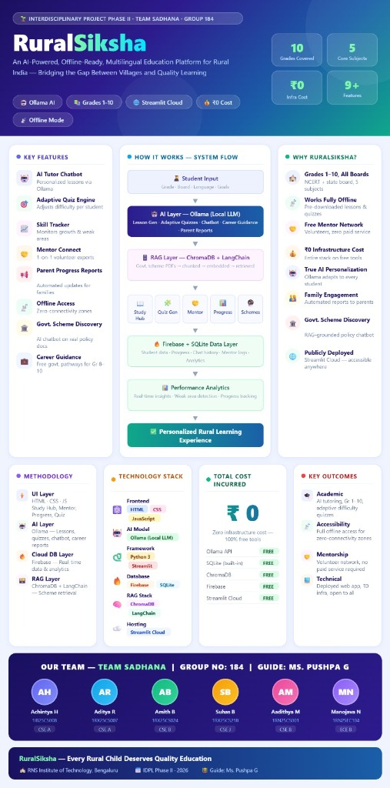
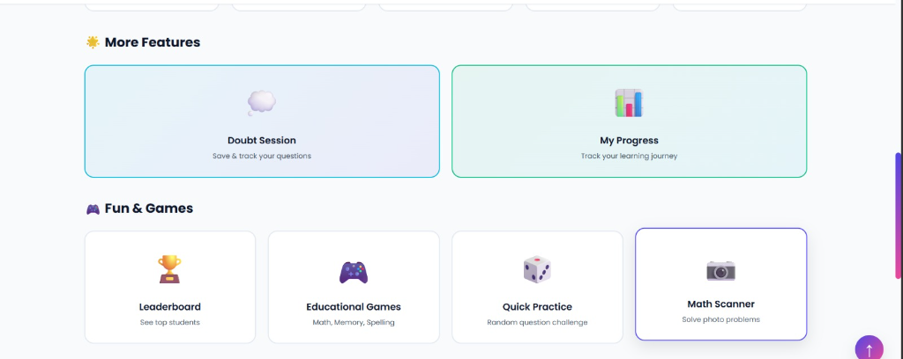
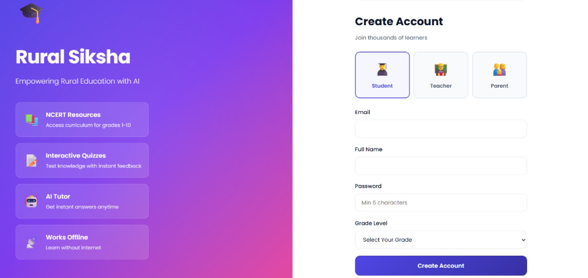
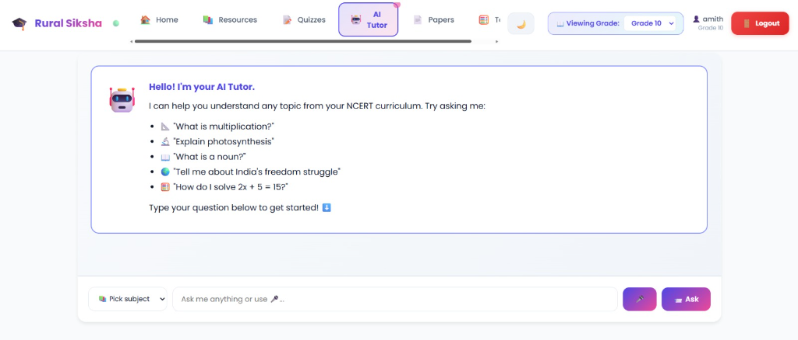
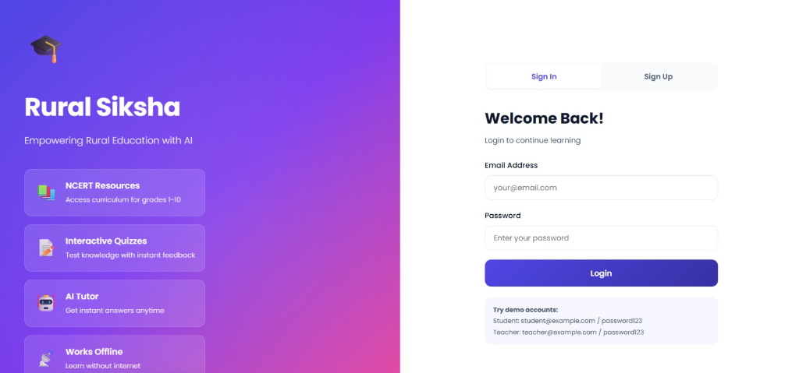

# 🌾 Rural Siksha

An offline-first educational platform for rural schools (grades 1-10), featuring AI-powered tutoring via Ollama LLM.

## Overview
<div align="center">
  
</div>

## Screenshots

<div align="center">
  
  
  
  
</div>

## Features

- **Student Interface**
  - Browse and download educational resources by grade and subject
  - Take quizzes with instant feedback (MCQ auto-grading)
  - Ask doubts and get immediate AI responses
  - Track learning progress
  - Full offline support

- **Teacher Interface**
  - Upload educational resources (PDFs, images, videos)
  - Answer student doubts with detailed explanations
  - View class progress and analytics
  - Manage quiz content

- **Offline Capabilities**
  - Download resources for offline access
  - Take quizzes offline, submit when online
  - View cached progress and resources
  - Automatic sync when connection restored

- **AI-Powered Tutoring**
  - Instant AI responses to student doubts
  - Uses local Ollama LLM (no internet required)
  - Teacher can review and augment AI responses

## Technology Stack

- **Frontend**: HTML, vanilla JavaScript, CSS (no build tools required)
- **Backend**: Python with Flask
- **Database**: SQLite (offline-friendly)
- **AI**: Ollama LLM (local, offline-capable)
- **Offline**: IndexedDB for local caching

## Prerequisites

- Python 3.8+
- Ollama with Mistral or Llama2 13B model installed locally
  - [Download Ollama](https://ollama.ai)
  - Install: `ollama pull mistral` (or `ollama pull llama2`)

## Installation

### 1. Clone and Setup

```bash
cd "Rural Siksha"
```

### 2. Create Virtual Environment

**On macOS/Linux:**
```bash
python3 -m venv venv
source venv/bin/activate
```

**On Windows (PowerShell):**
```powershell
python -m venv venv
.\venv\Scripts\Activate.ps1
```

### 3. Install Dependencies

```bash
pip install -r requirements.txt
```

### 4. Initialize Database

```bash
python setup.py --sample-data
```

This creates:
- SQLite database at `./data/ruralsiksha.db`
- Sample accounts for testing:
  - **Student**: `student@example.com` / `password123`
  - **Teacher**: `teacher@example.com` / `password123`

## Running the App

### 1. Start Ollama (in a separate terminal)

```bash
ollama serve
```

The Ollama API will be available at `http://localhost:11434`

### 2. Start the Flask App

```bash
python app.py
```

The app will be available at `http://localhost:5000`

### 3. Open in Browser

Navigate to `http://localhost:5000` and login with sample credentials

## Project Structure

```
rural-siksha/
├── app.py                      # Flask app factory
├── config.py                   # Configuration
├── requirements.txt            # Python dependencies
├── setup.py                    # Database initialization
├── data/
│   ├── ruralsiksha.db         # SQLite database (created on setup)
│   ├── resources/             # Uploaded resources
│   └── uploads/               # User submissions
├── backend/
│   ├── models.py              # Database models
│   ├── auth.py                # Authentication routes
│   ├── resources.py           # Resource CRUD
│   ├── health.py              # Health check
│   └── utils.py               # Utilities
├── frontend/
│   ├── index.html             # Main app
│   ├── js/
│   │   ├── app.js             # App initialization
│   │   ├── api.js             # API wrapper
│   │   ├── auth.js            # Auth handlers
│   │   ├── resources.js       # Resources
│   │   ├── doubts.js          # Doubts
│   │   ├── progress.js        # Progress
│   │   ├── offline.js         # Offline support
│   │   └── utils.js           # Utilities
│   └── css/
│       └── style.css          # Styles
└── README.md                  # This file
```

## API Endpoints

### Authentication
- `POST /api/auth/register` - Create account
- `POST /api/auth/login` - Login
- `POST /api/auth/logout` - Logout
- `GET /api/auth/me` - Current user info

### Resources
- `GET /api/resources?grade=5&subject=Math` - List resources
- `GET /api/resources/{id}` - Get resource details
- `GET /api/resources/{id}/download` - Download resource
- `POST /api/resources/upload` - Upload resource (teacher)

### Quizzes (Phase 2)
- `GET /api/quizzes` - List quizzes
- `POST /api/quizzes/{id}/start` - Start quiz
- `POST /api/quizzes/{id}/submit` - Submit answers

### Doubts
- `POST /api/doubts` - Create doubt
- `GET /api/doubts` - List doubts
- `GET /api/doubts/{id}` - Get doubt with responses
- `POST /api/doubts/{id}/respond` - Teacher responds (Phase 3)

### Progress
- `GET /api/progress` - Student dashboard
- `GET /api/progress/subject/{subject}` - Subject progress

### Health
- `GET /api/health` - System status (DB, Ollama)

## Development

### Run in Debug Mode

```bash
export FLASK_ENV=development  # or set on Windows
python app.py
```

### Database Migrations

Database is auto-created on first run. To reset:

```bash
rm data/ruralsiksha.db
python setup.py --sample-data
```

### Offline Testing

1. Open DevTools (F12)
2. Go to Network tab
3. Check "Offline" checkbox
4. Use the app - resources stay available if cached

## Roadmap

- **Phase 1 (Current)**: Auth, Resources, Offline Support ✓
- **Phase 2**: Quiz System, AI Tutoring (Ollama)
- **Phase 3**: Doubt Sessions, Teacher Dashboard
- **Phase 4**: Polish, NCRT Curriculum, Deployment

## Common Issues

### Ollama Not Connecting
- Ensure Ollama is running: `ollama serve`
- Check it's accessible at `http://localhost:11434/api/tags`

### Database Errors
- Delete `data/ruralsiksha.db` and run `python setup.py --sample-data`

### Port Already in Use
- Flask runs on port 5000 by default
- Change in `app.py` or use: `python app.py --port 5001`

## Performance Notes

- Supports 50+ concurrent students on single machine
- 1000+ quizzes/questions without degradation
- Dashboard queries optimized with denormalized progress table
- Resources cached locally for offline access

## Security

- Passwords hashed with Werkzeug
- Session cookies for authentication
- CORS disabled for single-machine deployment
- File uploads sanitized and stored separately

**Production Deployment**: Enable HTTPS, use environment variables for secrets, run behind Nginx

## License

Open source for educational purposes

## Support

For issues or feature requests, open an issue on GitHub

---

**Made with ❤️ for rural education**
